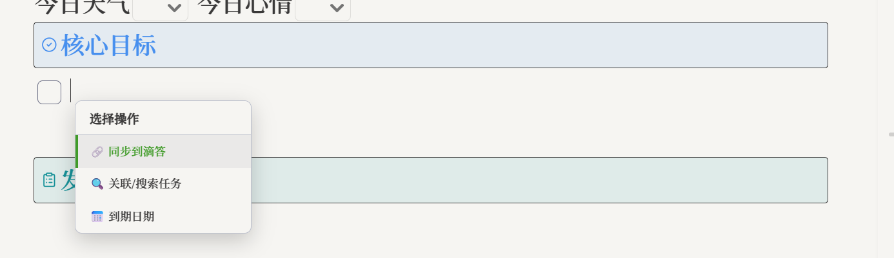
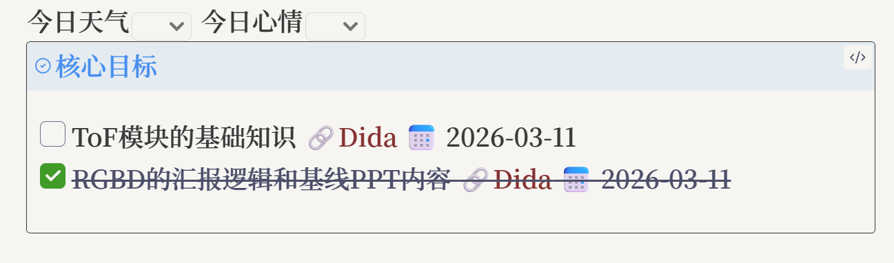
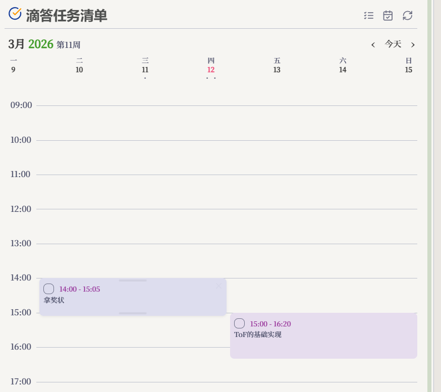
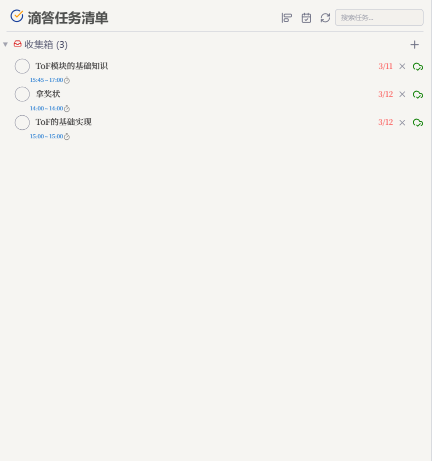

<h1 align="center">Obsidian-DidaSync</h1>

<b>Two-way Sync Between Obsidian and TickTick/Dida365.</b>

A powerful task synchronization plugin for Obsidian that brings your TickTick/Dida365 tasks directly into your notes with visual calendar and timeline views.

<a href="./README.md">简体中文</a> | <b>English</b>

## Highlights

### 🔄 Two-way Sync

Obsidian-DidaSync ensures your tasks are always up-to-date, whether you're in Obsidian or TickTick.

| Native Task Sync | Quick Task Creation |
|:--:|:--:|
|  |  |
| Sync your TickTick tasks directly into your notes, maintaining status and details across platforms | Quickly create tasks from within your Obsidian notes with dedicated modals and commands |

### 📅 Visual Task Management

| Time Block View | Timeline View | Sidebar View |
|:--:|:--:|:--:|
|  |  |  |
| Visualize your day with a calendar-style time block view of your tasks | A vertical timeline to track your task progress and upcoming deadlines | Manage your entire TickTick task list directly from the Obsidian sidebar |

## Features

| Feature | Description |
|---------|-------------|
| 🔄 **Two-way Sync** | Synchronize task status, content, and details between Obsidian and TickTick/Dida365 |
| 🗓️ **Visual Views** | Multiple views including Time Block, Timeline, and Sidebar Task List |
| 📝 **Daily Note Integration** | Automatically sync today's tasks directly into your daily notes |
| ⚡ **Quick Commands** | Add tasks to specific projects or insert task suggestions with simple hotkeys |
| 🕒 **Auto-Sync** | Configurable background synchronization to keep everything in sync |
| 🎛️ **Project Management** | View and manage tasks grouped by your TickTick/Dida365 projects |

## Quick Start

1. Open **Obsidian Settings** → **Community Plugins** → **Browse** → Search **"Obsidian-DidaSync"**
2. Install and enable the plugin
3. Configure your API key or use OAuth in the plugin settings to connect your TickTick/Dida365 account
4. Open the sidebar or use the ribbon icons to start syncing your tasks!

## Installation

### Community Plugin Store (Recommended)

See Quick Start above.

### Manual Installation

1. Go to [Releases](https://github.com/CYZice/Obsidian-DidaSync/releases) and download the latest `main.js`, `manifest.json`, and `styles.css`
2. Create a folder: `<vault>/.obsidian/plugins/Obsidian-DidaSync/`
3. Copy the files into that folder and enable the plugin in Obsidian Settings

## Support

If you find Obsidian-DidaSync helpful, please consider starring the repository or reporting issues to help improve it!

## License

[MIT License](LICENSE)
