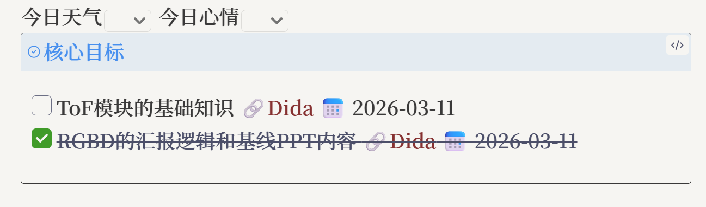
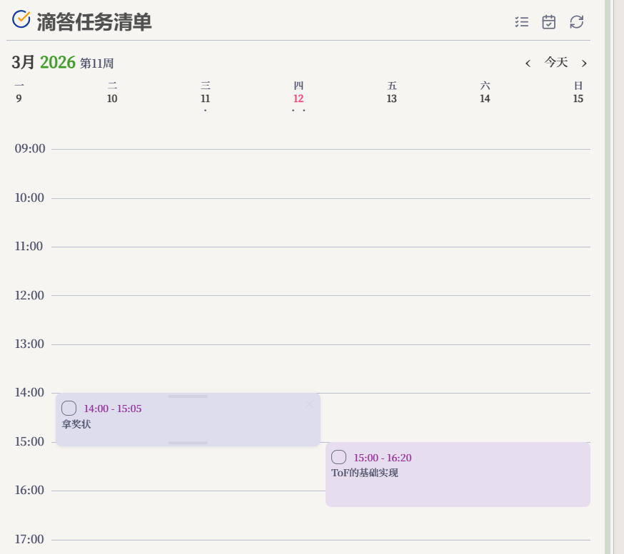

<h1 align="center">DidaSync</h1>

<b>让滴答清单 / TickTick 的任务，自然进入 Obsidian。</b>

在手机上快速记录，在 Obsidian 中安排、书写和回顾。DidaSync 将行动系统与笔记系统连接为一个连续的工作流。

<a href="./README.md">English</a> | <b>简体中文</b>

## 从收集，到完成，再到回顾

| 记录行动 | 安排执行 | 沉淀回顾 |
| :-- | :-- | :-- |
| 在滴答清单 / TickTick 中快速记录任务和笔记。 | 在 Obsidian 侧边栏、时间块和日历中组织任务。 | 将任务写入日记、周记或复盘笔记。 |

| 任务侧边栏 | 时间块视图 |
| :--: | :--: |
|  |  |

## 选择你的工作方式

### 同步任务

在 Obsidian 中查看、创建、完成和整理滴答任务。支持项目、子任务、拖拽、日期、提醒与重复规则的双向同步。

### 在笔记里行动

把 Markdown 的 `- [ ]` 关联到滴答任务；或按日、周、月、年把任务写进你的笔记模板。

### 把闪念带回 Vault

将滴答 NOTE 一条一文件同步为 Markdown，继续在 Obsidian 中扩写、整理和回顾。

## 功能一览

| 功能 | 何时使用 | 入口 |
| --- | --- | --- |
| 双向任务同步 | 在两个应用中处理同一组任务 | DidaSync 侧边栏 / 命令“手动双向同步” |
| 原生任务同步 | 希望在笔记中直接管理待办 | 设置 -> 同步 -> 启用原生任务同步 |
| 任务写入笔记 | 写日记、周记、计划与复盘 | 命令“同步任务到笔记” |
| 滴答笔记同步 | 保存手机闪念或滴答 NOTE | 设置 -> 同步 -> 启用滴答笔记同步 |
| 时间块、日历、番茄钟 | 安排一天、回顾进度、专注执行 | 任务侧边栏顶部入口 |
| MCP / AI | 让兼容 MCP 的 AI 协助管理任务 | 设置 -> MCP（桌面端） |

> **两种笔记功能的区别**：任务写入笔记是按时间范围生成任务汇总；滴答笔记同步是把 NOTE 保存为单独的 Markdown 文件。两者可以同时使用。

## 3 步开始

1. [安装并启用插件](#安装)。
2. 打开 `设置 -> DidaSync -> OAuth`，完成 Dida365 或 TickTick 授权。
3. 点击功能区 DidaSync 图标，或运行 **打开滴答清单**，然后执行一次 **手动双向同步**。

日常使用建议在 `设置 -> 同步` 开启自动同步。

## 使用指南

完整操作与边界说明请阅读 [DidaSync 使用指南](./docs/USER_GUIDE_ZH.md)：

- [同步并组织任务](./docs/USER_GUIDE_ZH.md#同步并组织任务)
- [在 Markdown 中管理待办](./docs/USER_GUIDE_ZH.md#在-markdown-中管理待办)
- [将任务写入笔记](./docs/USER_GUIDE_ZH.md#将任务写入笔记)
- [同步滴答笔记](./docs/USER_GUIDE_ZH.md#同步滴答笔记)
- [安排、回顾与专注](./docs/USER_GUIDE_ZH.md#安排回顾与专注)
- [MCP / AI](./docs/USER_GUIDE_ZH.md#mcp--ai桌面端)

插件内也提供 **设置 -> DidaSync -> 指南**：按使用场景说明功能，并可直接跳转到相应设置。

## 安装

### 官方插件市场

1. 打开 Obsidian 的 `设置 -> 第三方插件`。
2. 点击 `浏览`，搜索 `DidaSync`。
3. 安装并启用插件。

### 手动安装

1. 从 [Releases](https://github.com/CYZice/Obsidian-DidaSync/releases) 下载最新的 `main.js`、`manifest.json` 和 `styles.css`。
2. 放入 `<vault>/.obsidian/plugins/didasync/`。
3. 在 Obsidian 设置中启用插件。

## 授权与隐私

- DidaSync 通过官方 OAuth 2.0 连接 Dida365 或 TickTick，不保存用户名或密码。
- OAuth token、MCP token 与插件设置均保存在本地 Obsidian 插件数据中。
- MCP 服务仅监听本机 `127.0.0.1`；请勿公开 token。
- 插件不上传遥测数据，也不包含广告。

授权失败、移动端手动授权或同步异常，请查看[使用指南中的常见问题](./docs/USER_GUIDE_ZH.md#常见问题)。

## 支持

欢迎提交 [Issue](https://github.com/CYZice/Obsidian-DidaSync/issues) 或 Pull Request。

## 许可证

[MIT License](LICENSE)
